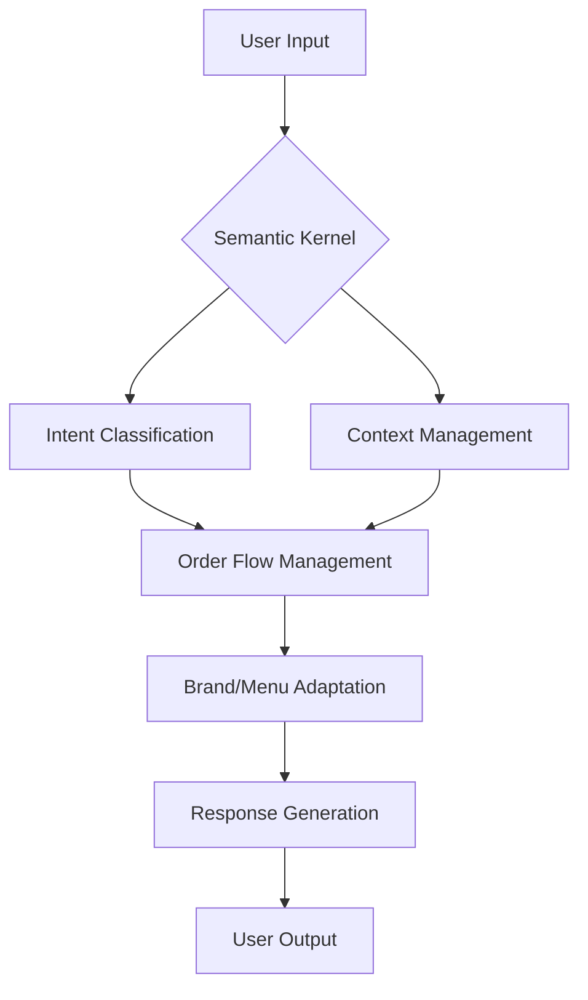

# Ordering ChatBot Project Presentation

## Introduction

The Ordering ChatBot project is designed to revolutionize the way customers interact with ordering systems. By leveraging conversational AI, the project aims to provide a seamless, efficient, and personalized ordering experience. This initiative is set within the broader context of digital transformation in customer service, where automation and intelligence are key drivers of innovation.

## Project Significance and Motivation

Conversational ordering systems are becoming increasingly vital as businesses seek to enhance customer engagement and streamline operations. The ability to handle orders accurately and efficiently, while providing a human-like interaction, is crucial for customer satisfaction and business growth. This project addresses the need for scalable, intelligent solutions that can adapt to various brands and menu configurations.

## Problem Statement

Traditional ordering systems often struggle with high volumes, manual errors, and lack of personalization. Customers expect quick, accurate, and context-aware responses, which are difficult to achieve with legacy systems. The core problem is to build a system that can:
- Understand diverse customer intents
- Adapt to different brands and menus
- Scale efficiently without sacrificing accuracy

## Our Solution

### Framework and Implementation

The solution is built on a modular architecture, with each component responsible for a specific aspect of the ordering process. The core technology is **Semantic Kernel**, which enables advanced intent recognition, context management, and flexible integration with external data sources.

**Key Technologies:**
- **Semantic Kernel**: For semantic understanding and orchestration of conversation flows.
- **Python**: For rapid development and integration of machine learning components.
- **Streamlit**: For building interactive evaluation and demo interfaces.
- **Custom Evaluation Scripts**: For automated testing and performance measurement.

**Implementation Flow Diagram:**

- **User Input** is processed by the Semantic Kernel, which orchestrates intent classification and context management.
- The system manages order flow, adapts to brand-specific menus, and generates responses.
- Modular design allows for easy extension and maintenance.

**Tradeoffs:**
- Chose Semantic Kernel for its flexibility and extensibility, trading off some initial complexity for long-term scalability.
- Modularization increases maintainability but requires careful interface design.
- Prioritized accuracy and adaptability over minimal resource usage.

### Experiment and Results

Experiments were conducted using automated scripts and real-world scenarios. Key metrics included intent recognition accuracy, order completion rate, and user satisfaction.

- **Results:**
    - High accuracy in intent classification and order flow management.
    - Positive feedback on user experience and adaptability to different brands.
    - Identified areas for improvement in menu configuration and brand adaptation.

### Learnings and Outstanding Work

**Learnings:**
- Modular, semantic-driven architectures are highly effective for conversational AI.
- Real-world data is essential for robust evaluation and continuous improvement.
- User feedback is invaluable for refining conversation flows and UI.

**Outstanding Work:**
- **MCP Integration:** Plan to integrate with Model Context Protocol (MCP) for dynamic menu and brand configuration, enabling real-time updates and easier scaling across multiple brands.
- Further optimization of context management and error handling.
- Enhanced analytics and monitoring for production deployments.

### Plan for Deployment

- Prepare for cloud deployment using containerization and CI/CD pipelines.
- Ensure security, monitoring, and feedback mechanisms are in place.
- Leverage the modular architecture for easy scaling and adaptation to new brands or markets.

**Scalability and Modularization:**
- The system is designed to support multiple brands and menus with minimal changes.
- Each module can be updated or replaced independently, supporting continuous improvement and rapid iteration.

---

This presentation provides a comprehensive overview of the Ordering ChatBot project, highlighting its significance, technical approach, results, and future directions.
